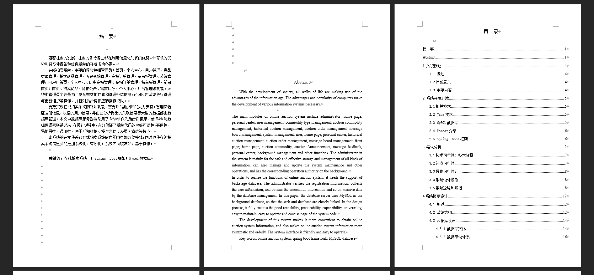
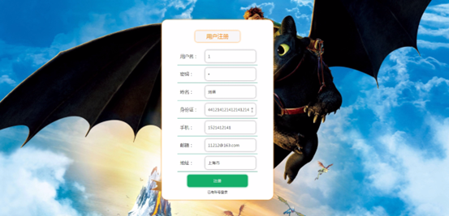
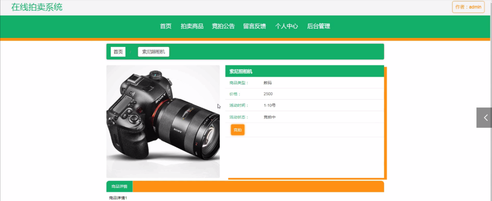
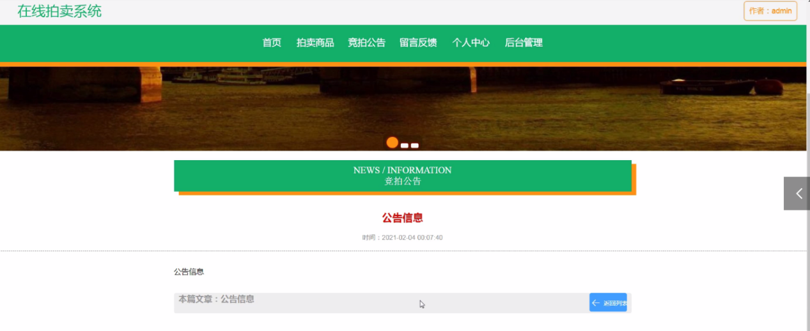
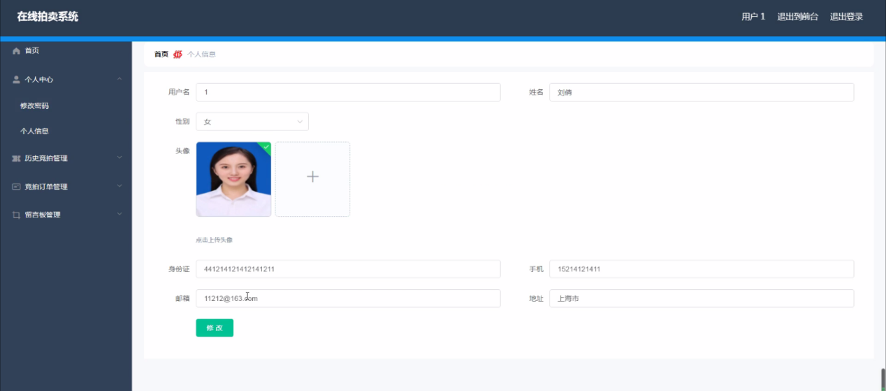
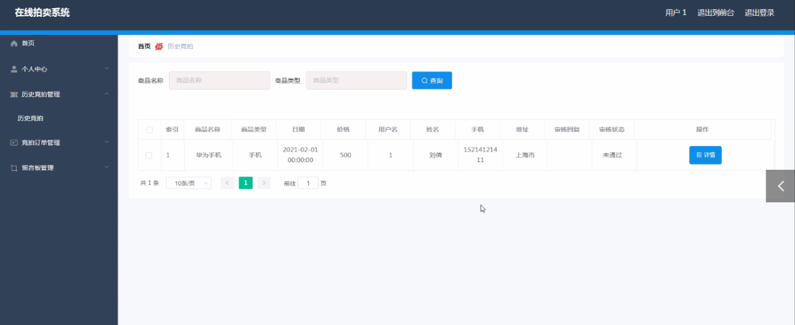

基于Springboot的在线拍卖系统（程序+论文）
=
### 完整代码获取地址：从戎源码网 ([https://armycodes.com/](https://armycodes.com/))
### 作者微信：19941326836  QQ：952045282 
### 承接计算机毕业设计、Java毕业设计、Python毕业设计、深度学习、机器学习
### 选题+开题报告+任务书+程序定制+安装调试+论文+答辩ppt 一条龙服务
### 所有选题地址https://github.com/nature924/allProject

一、项目介绍
---
系统包含两种角色：用户、管理员，系统分为前台和后台两大模块，主要功能如下：
### 前台功能

### 用户角色：
1. 首页：
   - 显示拍卖系统的主要信息，包括热门拍卖商品、最新竞拍公告等。
2. 拍卖商品：
   - 用户可以浏览当前正在拍卖的商品，查看商品详情，参与竞拍。
3. 竞拍公告：
   - 显示系统发布的最新竞拍公告，包括拍卖规则、竞拍时间等信息。

4. 留言反馈：
   - 用户可以提交反馈意见和建议，与管理员进行交流。

5. 个人中心：
   - 用户可以查看和编辑个人信息，管理个人账户。

### 后台功能

### 用户角色：

1. 个人中心：
   - 用户可以查看和编辑个人信息，管理个人账户。

2. 历史竞拍管理：
   - 查看用户参与过的历史竞拍记录，管理竞拍记录。

3. 竞拍订单管理：
   - 查看和管理用户的竞拍订单，处理订单状态。

4. 留言板管理：
   - 查看和管理用户提交的留言和反馈，与用户互动。

 管理员角色：

1. 个人中心：
   - 查看和编辑管理员个人信息，管理个人账户。

2. 用户管理：
   - 管理系统中的用户信息，包括用户的注册、修改、删除等操作。

3. 商品类型管理：
   - 管理拍卖商品的类型，添加、修改、删除商品分类。

4. 拍卖商品管理：
   - 管理拍卖商品的添加、编辑、删除和审核，设置拍卖商品的详细信息。

5. 历史竞拍管理：
   - 查看和管理所有用户的历史竞拍记录。

6. 竞拍订单管理：
   - 查看和管理所有用户的竞拍订单，处理订单状态。

7. 留言板管理：
   - 查看和管理所有用户的留言和反馈，与用户互动。

8. 系统管理：
   - 轮播图管理：管理系统首页轮播图，添加、编辑、删除轮播图。
   - 竞拍公告：发布和管理竞拍公告，通知用户最新的拍卖信息和规则。

二、项目技术
---
- 编程语言：Java
- 数据库：MySQL
- 项目管理工具：Maven
- 前端技术：VUE、HTML、Jquery、Bootstrap
- 后端技术：Spring、SpringMVC、MyBatis

三、运行环境
---
- 操作系统：Windows、macOS都可以
- JDK版本：JDK1.8以上都可以
- 开发工具：IDEA、Ecplise、Myecplise都可以
- 数据库: MySQL5.7以上都可以
- Tomcat：任意版本都可以
- Maven：任意版本都可以

四、运行截图
---
### 论文截图：

### 程序截图：

